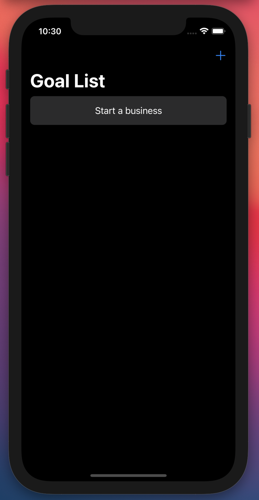
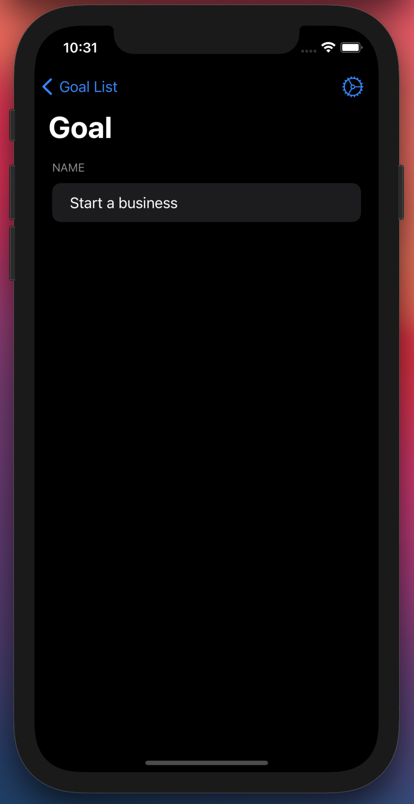
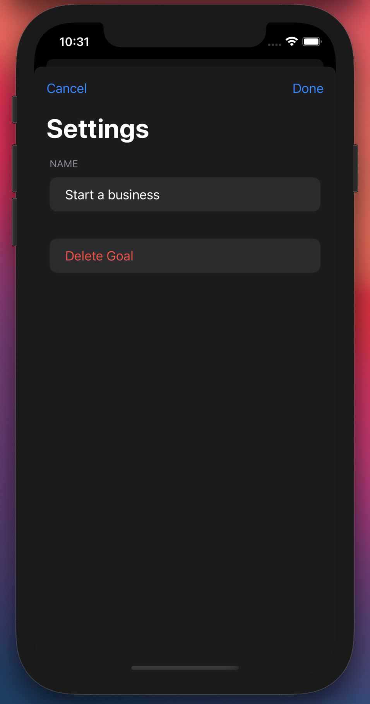
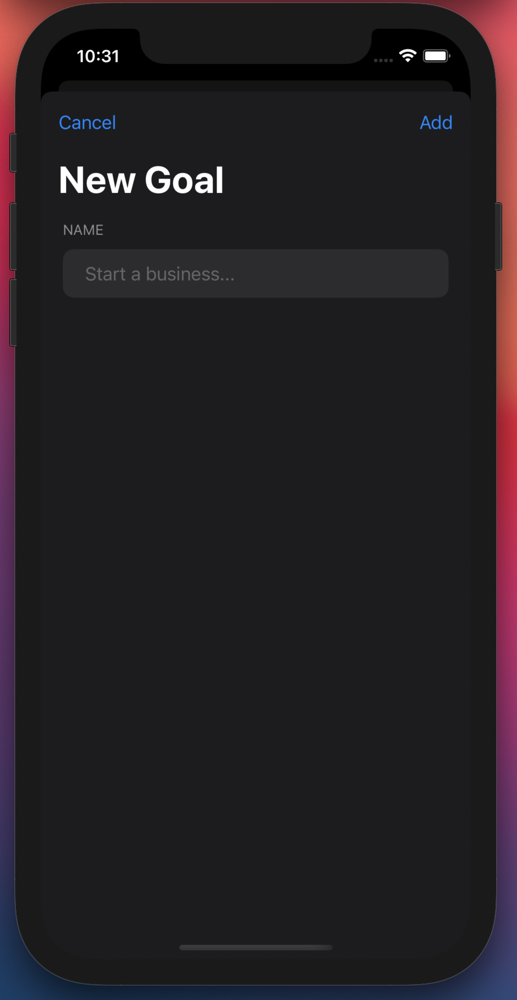

# observable-demo

## Purpose
The purpose of this project is to illustrate how to manage state with the use of ObservedObjects in SwiftUI. While there are many ways to achieve this, this is what came to mind for me - and it works!
I hope you enjoy and learn something valuable from it.

## Screenshots

## Questions/Concerns
I am currently studying SwiftUI so some of these practices may not necessarily be the most efficient way of going about it. That being said, I love learning new things so if you see something that could be improved or would like to start a conversation with me, you can reach me on Discord at patrickjohnson#0001
